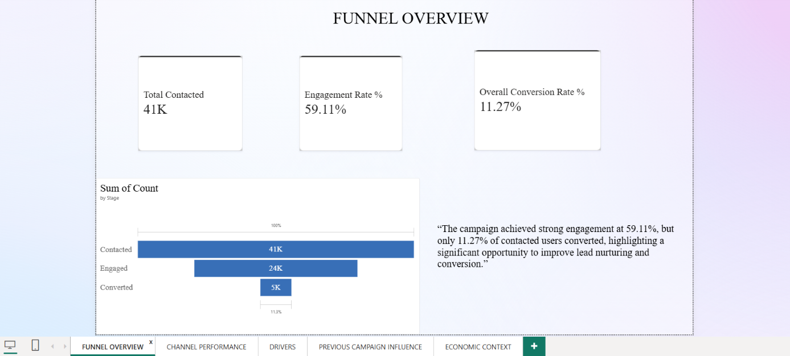
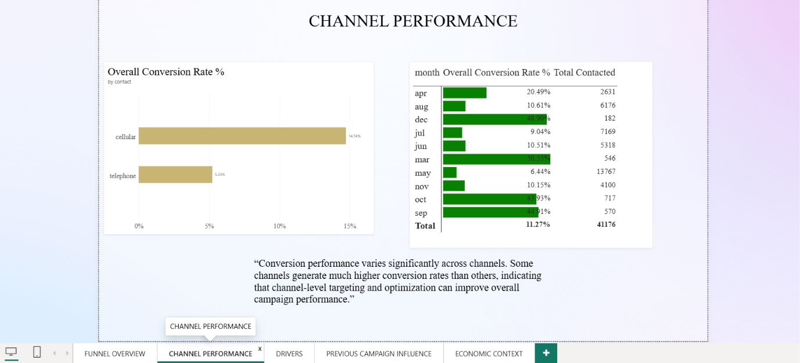
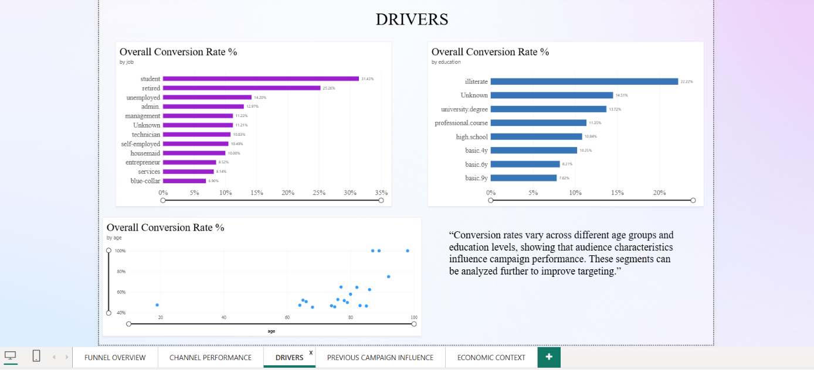
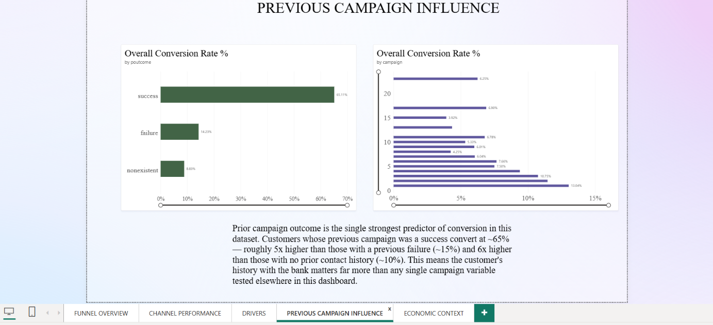
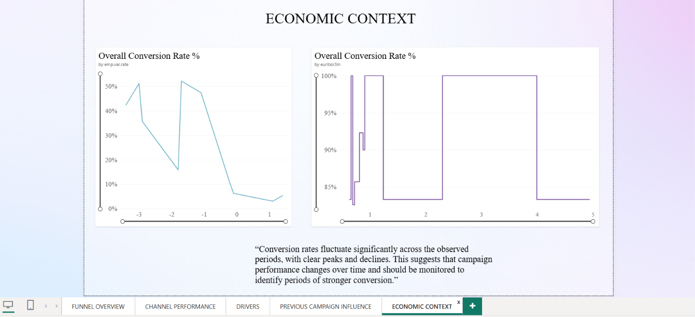

# Task 3: Marketing Funnel & Conversion Performance Analysis

## Problem
Find where prospects drop off in a bank's term-deposit campaign funnel, which segments convert best, and how to improve conversion.

## Dataset
[Bank Marketing (UCI)](https://archive.ics.uci.edu/dataset/222/bank+marketing), `bank-additional-full`, about 41K contacts.

## Tools
Python (pandas, Google Colab) and Power BI Desktop.

## Funnel Definition
- **Contacted:** every customer in the campaign
- **Engaged:** previously contacted, or contacted more than once this campaign
- **Converted:** subscribed to the term deposit

> **Note:** The Engaged stage is a proxy built from the data, since the dataset has no explicit mid-funnel event.

## Key Insights

### Funnel Overview
41K contacted, 24K engaged (59.11%), 5K converted (11.3% overall).

### Channel Performance
Cellular contacts convert at about 15% versus about 5% for telephone, nearly 3x higher. Timing matters too: May accounts for a third of all contacts (13,767 of 41,176) yet converts at only 6.44%, while March, September, October and December each convert at 44-51% on far smaller volumes (under 720 contacts each). The campaign spends most of its effort in its weakest month.
**Recommendation:** Shift outreach toward cellular and test more activity in the high-converting months. The small monthly samples mean this should be tested before reallocating heavily.

### Demographic Drivers
Students (~31%) and retirees (~25%) convert at roughly 3-4.5x the rate of blue-collar (~7%) and services (~8%) workers. Education shows a milder pattern: university degree holders convert at ~14% versus ~8% for those with 9 years of basic education. The "illiterate" group's ~22% almost certainly comes from a very small group, so check its customer count before relying on it.
**Recommendation:** Prioritize students and retirees, and test different messaging for the lowest-converting segments.

### Previous Campaign Influence
Prior campaign outcome is the strongest predictor of conversion. Customers whose previous campaign succeeded convert at ~65%, about 4.5x the rate of previous failures (~14%) and over 7x the rate of customers never contacted before (~9%). Conversion also falls as contact attempts pile up, from about 13% on the first contact to roughly 4-7% after six or more attempts. This is diminishing returns.
**Recommendation:** Cap the number of attempts per prospect and put previously successful customers first.

### Economic Context
Conversion is much higher when the employment variation rate is strongly negative: roughly 35-52% at values below -1, versus about 3-6% at 0 or above (one dip near -1.8, ~16%). Customers seem more willing to lock money into term deposits in weak economic conditions, so campaign timing could follow economic cycles.
**Caveat:** This is a correlation across a small number of distinct economic periods, so treat it as a hypothesis, not a proven cause.

## Recommendations Summary
1. Prioritize customers with a previously successful campaign.
2. Shift outreach toward cellular contacts.
3. Test more activity in March, September, October and December before reallocating heavily.
4. Focus on students and retirees; test new messaging for blue-collar and services segments.
5. Cap contact attempts per prospect.
6. Treat the economic link as a hypothesis to validate.

## Dashboard Preview

**Full export:** [Dashboard PDF](DASHBOARD/Future_Interns_TASK_3.pdf)

**Interactive file:** [Power BI Dashboard](DASHBOARD/TASK_3.pbix)

---
*Future Interns Data Science & Analytics Internship*
